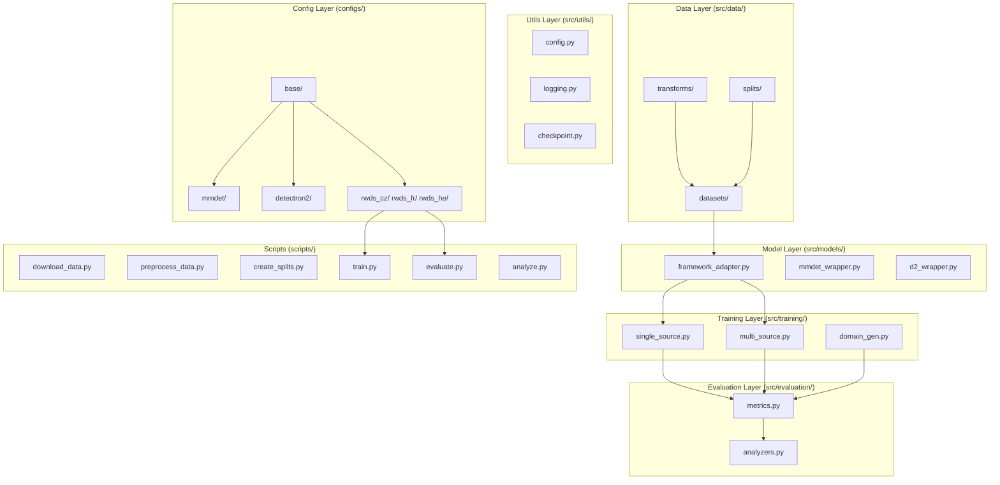

# Robust Object Detection in Satellite Images under Distribution Shift — Architecture Design

> **Date:** 2026-05-05
> **Status:** Approved
> **Stack:** MMDetection + Detectron2 dual framework, PyTorch 2.x, TensorBoard, OmegaConf

---

## 1. Overview

This document describes the architecture design for the Robust Object Detection in Satellite Images under Distribution Shift project. The system is a research framework for training and evaluating object detectors across climate zones and disaster scenarios, built on top of MMDetection and Detectron2 with a unified abstraction layer.

**Key goals:**
- Train and evaluate detectors under single-source and multi-source domain settings
- Benchmark mAP, Performance Drop (PD), and Harmonic Mean (H) across climate zones (RWDS-CZ), flood regions (RWDS-FR), and hurricane events (RWDS-HE)
- Support dual-framework (MMDetection + Detectron2) with a unified adapter
- Single GPU, local experiment tracking via TensorBoard

---

## 2. Architecture Overview

The framework follows a **layered modular architecture**. Each layer has a clear responsibility and communicates through well-defined interfaces. The four primary layers are: **Data**, **Model**, **Training**, and **Evaluation**.



### Data Flow

1. `scripts/download_data.py` → raw datasets into `data/raw/`
2. `scripts/preprocess_data.py` → cropped tiles + COCO annotations into `data/processed/`
3. `scripts/create_splits.py` → train/val/test JSON splits into `data/splits/`
4. `scripts/train.py` with `configs/*.yaml` → training → checkpoints into `results/experiments/{exp_id}/`
5. `scripts/evaluate.py` → inference → metrics logged to TensorBoard + JSON results
6. `scripts/analyze.py` → plots and reports

---

## 3. Module Breakdown

### 3.1 Data Layer (`src/data/`)

| Module | File | Responsibility |
|--------|------|----------------|
| Datasets | `datasets/base.py` | Abstract base class defining `__len__`, `__getitem__` interfaces. Returns image tensor + list of bboxes/labels. |
| | `datasets/xview.py` | xView dataset loader. Handles large images with tiling. |
| | `datasets/xbd.py` | xBD dataset loader. Converts polygon annotations to bounding boxes. |
| | `datasets/rwds.py` | RWDS wrapper: maps xView/xBD data to RWDS-CZ/RWDS-FR/RWDS-HE splits. |
| Transforms | `transforms/common.py` | Flip, resize, crop, normalize — deterministic transforms. |
| | `transforms/geometric.py` | Rotation, perspective, mosaic, mixup. |
| | `transforms/domain_rand.py` | Color jitter, weather simulation (fog, rain), domain randomization. |
| Splits | `splits/allocator.py` | Implements Algorithm 1 from the RWDS paper. Balanced train/val/test allocation per domain. |

### 3.2 Model Layer (`src/models/`)

| Module | File | Responsibility |
|--------|------|----------------|
| Framework Adapter | `framework_adapter.py` | Factory pattern. `build_detector(config) -> Detector`. Reads `framework: mmdet` or `framework: detectron2` from config and dispatches to correct wrapper. |
| MMDetection Wrapper | `mmdet_wrapper.py` | Wraps MMDetection detector APIs behind the common interface. Handles config conversion. |
| Detectron2 Wrapper | `d2_wrapper.py` | Wraps Detectron2 detector APIs behind the common interface. Handles config conversion. |

**Adapter Interface:**
```python
# src/models/framework_adapter.py
def build_detector(config: DictConfig) -> Detector:
    """Build detector from config. Reads config.framework to dispatch."""

class Detector:
    def train(self, train_loader, val_loader, cfg): ...
    def evaluate(self, data_loader, cfg): ...
    def predict(self, image: Tensor) -> List[Dict]: ...
    def save_checkpoint(self, path): ...
    def load_checkpoint(self, path): ...
```

### 3.3 Training Layer (`src/training/`)

| Module | File | Responsibility |
|--------|------|----------------|
| Single Source | `single_source.py` | Train detector on a single domain. Standard epoch loop, checkpointing, TensorBoard logging. Interface: `train_single_source(detector, train_loader, val_loader, cfg) -> checkpoint_path`. |
| Multi Source | `multi_source.py` | Multi-source training: `MultiSourceDataLoader` samples batches from multiple domains with configurable ratios. Interface: `train_multi_source(detector, domains, cfg)`. |
| Domain Generalisation | `domain_gen.py` | DG techniques: Gradient Reversal Layer (GRL), CLIP/RemoteCLIP feature alignment, meta-learning inner loop. Interface: `apply_dg_technique(model, technique, cfg)`. |

### 3.4 Evaluation Layer (`src/evaluation/`)

| Module | File | Responsibility |
|--------|------|----------------|
| Metrics | `metrics.py` | Computes: mAP@0.5:0.95 (MS-COCO style), Performance Drop `PD = 100 * (mAP_ID - mAP_OOD) / mAP_ID`, Harmonic Mean `H = 2 * mAP_OOD * mAP_ID / (mAP_OOD + mAP_ID)`. Interface: `compute_all_metrics(predictions, targets) -> Dict[str, float]`. |
| Analyzers | `analyzers.py` | Per-class and per-domain breakdown. t-SNE visualization of detector features. Generates heatmaps of PD across classes. Interface: `analyze_results(results, output_dir)`. |

### 3.5 Utils Layer (`src/utils/`)

| Module | File | Responsibility |
|--------|------|----------------|
| Config | `config.py` | OmegaConf YAML loading and hierarchical merge: base + dataset + model + training overrides. |
| Logging | `logging.py` | TensorBoard `SummaryWriter` wrapper + JSON structured logs per experiment. Logs git commit hash for reproducibility. |
| Checkpoint | `checkpoint.py` | Save/load model + optimizer + scheduler + epoch state. Handles framework-specific state dict conversion. |

---

## 4. Config System

### Directory Structure

```
configs/
├── base/
│   ├── base_data.yaml        # Common data paths, image size, normalization
│   ├── base_training.yaml     # optimizer (SGD/AdamW), scheduler, epochs, batch size
│   └── base_augmentation.yaml # Default augmentation pipeline
├── mmdet/
│   ├── faster_rcnn_r50_fpn.yaml
│   └── dino_swin.yaml
├── detectron2/
│   ├── faster_rcnn_r50_fpn.yaml
│   └── dino.yaml
├── rwds_cz/
│   ├── single_source/
│   │   ├── tropical.yaml
│   │   ├── arid.yaml
│   │   └── temperate.yaml
│   └── multi_source/
│       └── tropical_arid.yaml
├── rwds_fr/
│   ├── single_source/
│   │   ├── us_flood.yaml
│   │   └── india_flood.yaml
│   └── multi_source/
└── rwds_he/
    ├── single_source/
    └── multi_source/
```

### Config Inheritance

Configs use OmegaConf merge. A typical experiment config inherits:
```
base_data + base_training + base_augmentation → model-specific (mmdet/detectron2) → dataset-specific overrides
```

Example: `configs/rwds_cz/multi_source/tropical_arid.yaml` specifies:
```yaml
# @package _global_
defaults:
  - base/base_data
  - base/base_training
  - base/base_augmentation
  - mmdet/faster_rcnn_r50_fpn

dataset:
  name: rwds_cz
  domains: [tropical, arid]
  data_root: data/processed/rwds_cz
  image_size: 512

training:
  epochs: 50
  batch_size: 4
  multi_source: true
  domain_ratios: [0.5, 0.5]
```

---

## 5. Scripts Layer

| Script | Purpose | Key Arguments |
|--------|---------|---------------|
| `download_data.py` | Download xView, xBD from public URLs. Extract archives. Validate checksums. | `--dataset {xview,xbd}`, `--output data/raw/` |
| `preprocess_data.py` | Crop images to 512x512 tiles (with stride), convert polygons to bboxes (xBD), filter classes by frequency, export COCO JSON. | `--input data/raw/`, `--output data/processed/`, `--tile-size 512`, `--stride 256` |
| `create_splits.py` | Implement RWDS Algorithm 1: balanced train/val/test allocation per class and domain. | `--dataset rwds_cz`, `--output data/splits/`, `--train-ratio 0.7` |
| `train.py` | Unified training entry point. Initializes framework via adapter, runs single-source or multi-source training. | `--config`, `--single-source`, `--multi-source`, `--dg-technique {none,grad_reversal,clip_align}`, `--gpu` |
| `evaluate.py` | Load checkpoint, run inference on test sets (ID + OOD), compute mAP/PD/H. Support leave-one-domain-out. | `--checkpoint`, `--domains`, `--output-dir` |
| `analyze.py` | Generate visualizations: t-SNE plots, PD bar charts, per-class heatmaps, confusion matrices. | `--results-dir`, `--output-dir` |

---

## 6. Experiment Tracking

### Directory Structure

```
results/
└── experiments/
    └── {exp_id}/
        ├── config.yaml          # Resolved config (merged)
        ├── checkpoint_best.pth   # Best validation checkpoint
        ├── checkpoint_last.pth  # Final epoch checkpoint
        ├── tensorboard/         # TensorBoard event files
        └── eval_results.json    # {mAP_ID, mAP_OOD, PD, H, per_class_results}
```

### Experiment ID Format

`{dataset}_{training_mode}_{domains}_{dg_technique}_{timestamp}`

Example: `rwds_cz_multi_tropical_arid_grad_reversal_20260505_143022`

### Metrics Logged

- Per epoch: training loss, validation mAP, learning rate
- Per evaluation: mAP@0.5, mAP@0.5:0.95, PD, H, per-class AP
- Structured JSON log: config, git commit, GPU info, random seed

---

## 7. Testing Strategy

### Unit Tests (`tests/unit/`)

| File | What it tests |
|------|--------------|
| `test_datasets.py` | Dataset `__len__`, `__getitem__` returns correct shape. COCO format output validation. |
| `test_metrics.py` | mAP, PD, H calculations against known ground-truth values (synthetic data). |
| `test_transforms.py` | Augmentation consistency: deterministic transforms produce reproducible output. |

### Integration Tests (`tests/integration/`)

| File | What it tests |
|------|--------------|
| `test_training.py` | End-to-end train 1 epoch with dummy data. Verify loss decreases. |
| `test_evaluation.py` | Load dummy checkpoint, run evaluation pipeline, verify metric output format. |

### CI (GitHub Actions)

- Run `pytest tests/` on every push
- Lint with `ruff` and type-check with `mypy`

---

## 8. Dependency Management

| File | Contents |
|------|----------|
| `requirements.txt` | torch, torchvision, mmdet, detectron2, tensorboard, pycocotools, albumentations, omegaconf, pandas, matplotlib, seaborn |
| `requirements-dev.txt` | pytest, ruff, mypy, black |
| `pyproject.toml` | Project metadata, entry points (`scripts/train.py`, `scripts/evaluate.py`, etc.) |

---

## 9. Key Design Decisions

1. **Dual-framework via adapter pattern.** `FrameworkAdapter` is the single entry point for building detectors. The rest of the codebase is framework-agnostic. Swapping MMDetection for Detectron2 only requires changing one config field.

2. **Hierarchical config inheritance.** Avoids duplication. Base configs define defaults; dataset-specific configs override only what differs. Single config file is self-contained for reproducibility.

3. **Multi-source via balanced domain sampling.** `MultiSourceDataLoader` wraps multiple domain loaders and yields batches proportionally. No framework-level changes needed — works with both MMDetection and Detectron2.

4. **Metrics computed post-hoc.** Detection metrics (mAP) use pycocotools for standard COCO evaluation. PD and H are computed from ID/OOD mAP values. No special framework integration required.

5. **Experiment IDs for isolation.** Every run gets a unique experiment ID. Artifacts are never overwritten. TensorBoard logs per-experiment enable direct comparison.

6. **RWDS construction is a preprocessing step, not a runtime concern.** Datasets are preprocessed once into `data/processed/` with COCO-format JSON annotations. Both frameworks consume the same preprocessed data.

7. **Domain-generalisation techniques are modular.** Each DG technique (GRL, CLIP alignment, meta-learning) is a separate module. They can be composed with single-source or multi-source training by passing `--dg-technique`.

---

## 10. Scope Boundaries

**In scope:**
- Data downloading, preprocessing, and splitting pipelines
- Baseline detector training (single + multi-source)
- Domain-generalisation techniques
- Evaluation with mAP, PD, H metrics
- Analysis and visualization notebooks
- Reproducible experiment tracking

**Out of scope:**
- Model serving / deployment / API
- ONNX export
- Multi-node distributed training
- Real-time inference optimization
